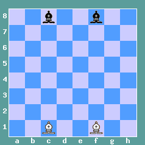
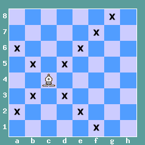
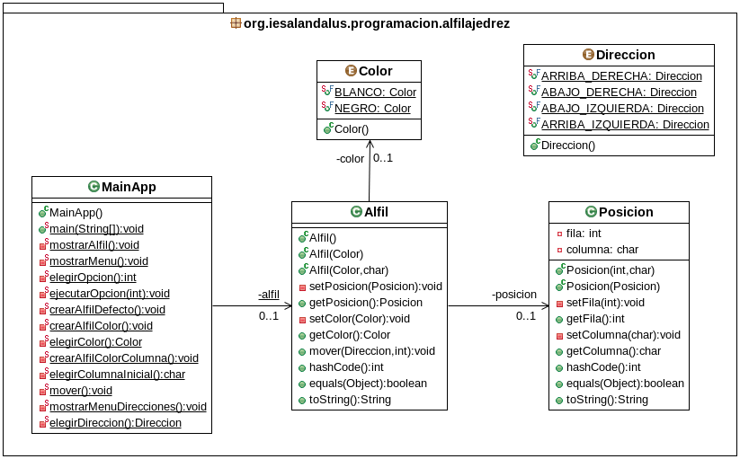

# Tarea Alfil Ajedrez
## Profesor: José Ramón Jiménez Reyes
## Alumno:

La tarea va a consistir en modelar el movimiento de un peón de ajedrez por el tablero de dicho juego.

Imágenes obtenidas de la web: <a href="https://www.123ajedrez.com/reglas-basicas/el-alfil">123ajedrez.com</a> (Enrique Moreno)

En la primera imagen puedes observar cuál es el posicionamiento inicial válido para los alfiles dependiendo de su color.

En la segunda imagen puedes apreciar cuáles son los movimientos válidos para un alfil. 

Como se puede observar, dado un color, un alfil ocupa la casilla blanca y otro la negra. Dado que el movimiento de un alfil es siempre en diagonal, el alfil que ocupa la casilla inicial blanca sólo se mueve por casillas blancas y el alfil que ocupa la casilla inicial negra sólo se mueve por casillas negras.

En este repositorio hay un esqueleto de proyecto gradle que ya lleva incluidos todos los test necesarios que el programa debe pasar.

Para ello te pongo un diagrama de clases para el mismo y poco a poco te iré explicando los diferentes pasos a seguir:

1. Lo primero que debes hacer es un `fork` del repositorio donde he colocado el esqueleto de este proyecto.
2. Clona tu repositorio remoto recién copiado en GitHub a un repositorio local que será donde irás realizando lo que a continuación se te pide. Modifica el archivo `README.md` para que incluya tu nombre en el apartado "Alumno". Realiza tu primer commit.
3. Crea un enumerado llamado `Color`, dentro del paquete adecuado, que contenga los valores: `BLANCO` y `NEGRO`. Realiza un commit.
4. Crea un enumerado llamado `Direccion`, dentro del paquete adecuado, que contenga los valores: `ARRIBA_DERECHA`, `ABAJO_DERECHA`, `ABAJO_IZQUIERDA` y `ARRIBA_IZQUIERDA`.  Realiza un commit.
5. Crea la clase `Posicion`. Crea los atributos `fila` (int) y `columna` (char) con la visibilidad adecuada. Realiza un commit.
6. Crea los métodos `get` y `set` para los atributos. Recuerda que para el método `set` se debe tener en cuenta que los valores son correctos (las filas van del 1 al 8 -ambos inclusive- y las columnas de la 'a' a la 'h' -ambas inclusive-)  y si no se lance una excepción del tipo `IllegalArgumentException` con el mensaje adecuado y no modifique los atributos. Realiza un commit.
7. Crea un constructor para esta clase que acepte como parámetros la fila y la columna y que los asigne a los atributos si son correctos  y si no lance una excepción del mismo tipo que la anterior indicando el problema. Para ello utiliza los métodos `set` anteriormente creados. Realiza un commit.
8. Crea el constructor copia para esta clase. Realiza un commit.
9. Crea los métodos `equals` y `hashCode` para esta clase. Realiza un commit.
10. Crea el método `toString` que devolverá un `String` y será la representación de la fila y la columna. Realiza un commit.
11. Crea la clase `Alfil`, dentro del paquete adecuado, cuyos atributos serán un `color` (del tipo enumerado `Color`) y posicion (de la clase `Posicion`), con la visibilidad adecuada. Realiza un commit.
12. Crea los métodos `get` y `set` para cada atributo con la visibilidad adecuada. Estos métodos siempre comprobarán la validez de los parámetros pasados y si no son correctos deberá lanzar la excepción adecuada (`NullPointerException` o `IllegalArgumentException`) con el mensaje adecuado. Realiza un commit.
13. Crea un constructor por defecto para esta clase que cree un alfil negro en la posición '8f'. Realiza un commit.
14. Crea un constructor para la clase que acepte como parámetro el color y que creará un alfil de dicho color cuya posición será '1f' si es blanco o '8f' si es negro. Realiza un commit.
15. Crea un constructor para la clase que acepte como parámetros el color y la columna inicial. La columna inicial debe ser válida (de lo contrario debe lanzar la excepción `IllegalArgumentException` con un mensaje adecuado) y creara un alfil del color dado y colocado en dicha columna ('c' o 'f') y cuya fila será la 1 si es blanco y la 8 si es negro. Realiza un commit.
16. Crea el método `mover` que acepte como parámetro una `Direccion` y la cantidad de `pasos` a mover en dicha dirección. Los pasos deben ser positivos y la dirección no puede ser nula o de lo contrario debe lanzar una excepción adecuada (`NullPointerException` o `IllegalArgumentException`) con el mensaje adecuado. Si no puede realizar dicho movimiento, debido a que el álfil se sale del tablero, debe lanzar una excepción del tipo `OperationNotSupportedException` con un mensaje adecuado y no modificará la posición del alfil. Realiza un commit.
17. Crea los métodos `equals` y `hashCode` para esta clase. Realiza un commit.
18. Crea el método `toString` que devuelva un `String` que será la representación de dicho objeto (color y posición). Realiza un commit.
19. Crea los diferentes métodos que se indican en el diagrama de clases para permitir que el método `main` nos muestre un menú que nos permitirá crear un alfil por defecto, crear un alfil de un color, crear un alfil de un color en una columna inicial dada ('c' o 'f'), mover el peón y salir. Después de cada operación se nos mostrará el estado actual de nuestro alfil. El menú se repetirá mientras no elijamos la opción salir. En todo caso se debe validar que todas las entradas al programa son correctas. Para ello implementa los siguientes métodos:
    1. `void mostrarAlfil()`: mostrará por consola la representación del alfil representado por el atributo de clase `alfil` (crea el atributo si aún no lo has hecho). Realiza un commit.
    2. `void mostrarMenu()`: mostrará por consola el menú con las diferentes opciones de nuestro programa. Realiza un commit.
    3. `int elegirOpción()`: Nos mostrará un mensaje para que elijamos una opción del menú anteriormente creado y nos pedirá que introduzcamos por teclado la opción hasta que ésta sea valida. Devolverá la opción elegida. Realiza un commit.
    4. `Color elegirColor()`: Nos preguntará que elijamos un color mientras éste no sea válido y dependiendo de la opción elegida devolverá un color u otro. Realiza un commit.
    5. `char elegirColumnaInicial()`: Nos preguntará que elijamos la columna inicial mientras ésta no sea válida y devolverá la columna elegida. Realiza un commit.
    6. `void mostrarMenuDirecciones()`: Mostrará por consola un menú con las diferentes direcciones que podemos elegir. Realiza un commit.
    7. `Direccion elegirDireccion()`: Nos mostrará un mensaje para que elijamos una opción del menú anteriormente creado y nos pedirá que introduzcamos por teclado la opción hasta que ésta sea valida. Devolverá la dirección elegida. Realiza un commit.
    8. `void crearAlfilDefecto()`: Asignará al atributo de clase `alfil` una nueva instancia de un alfil creado con el constructor por defecto. Realiza un commit.
    9. `void crearAlfilColor()`: Asignará al atributo de clase `alfil` una nueva instancia de un alfil creado con el constructor al que le pasamos el color. Este método debe utilizar métodos ya implementados anteriormente. Realiza un commit.
    10. `void crearAlfilColorColumna()`: Asignará al atributo de clase `alfil` una nueva instancia de un alfil creado con el constructor al que le pasamos el color y la columna inicial. Este método debe utilizar métodos ya implementados anteriormente. Realiza un commit.
    11. `void mover()`: Mostrará un menú con las posibles direcciones, nos preguntará por la dirección y la cantidad de pasos a mover y moverá el alfil según esos parámetros. Este método debe utilizar métodos ya implementados anteriormente. Realiza un commit.
    12. `void ejecutarOpcion(int)`: Depediendo de la opción pasada como parámetro, actuará en consecuencia. Este método debe utilizar métodos ya implementados anteriormente. Realiza un commit.
    13. `void main(String[])`: Método principal de nuestra aplicación que deberá realizar lo que se pide en el apartado 19 y que debe apoyarse en los métodos anteriormente implementados. Realiza un commit y realiza el push a tu repositorio remoto en GitHub.

#### Se valorará:

    La indentación debe ser correcta en cada uno de los apartados.
    El nombre de las variables debe ser adecuado.
    Se debe utilizar la clase `Entrada` para realizar la entrada por teclado.
    El programa debe pasar todas las pruebas que van en el esqueleto del proyecto y toda entrada del programa será validada, para evitar que el programa termine abruptamente debido a una excepción.
    La corrección ortográfica tanto en los comentarios como en los mensajes que se muestren al usuario.
